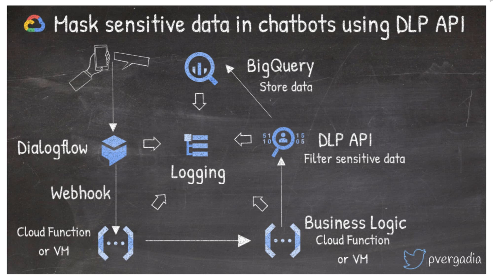
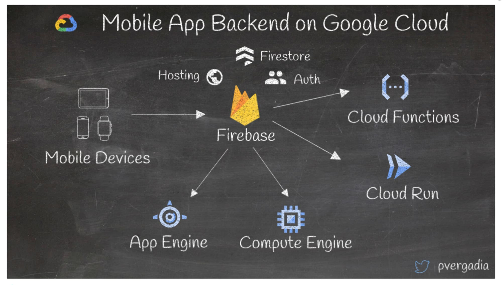

# Popular architectures

## 1. Set up a hybrid architecture on Google Cloud and on-premises
```


```


 


## 2 Mask sensitive data in chatbots using Data Loss Prevention (DLP) API
Imagine a situation where your business or users require sharing sensitive information with a chatbot. To do so, you can use Dialogflow, which helps create conversational experiences for your users without having to learn machine learning or artificial intelligence.   

For example, in this architecture, the user interacts with a chat experience on a phone or the web, which calls the Dialogflow agent. The request gets fulfilled by business logic using serverless Cloud Functions or virtual machines. Then, if you want to de-identify sensitive information from the chat experience, you can use the DLP API and store it to BigQuery for further processing.

 


## 3 Build mobile app backends on Google Cloud
When building mobile apps on Google Cloud, Firebase is a good option for storage, user authentication, hosting and more. You can integrate Firebase with multiple backends such as serverless Cloud Functions to glue together business logic or Cloud Run to run serverless containers as app backends. You can also connect with App Engine and Compute Engine, if that’s where your backends exist. 

 

https://cloud.google.com/blog/products/application-development/13-popular-application-architectures-for-google-cloud