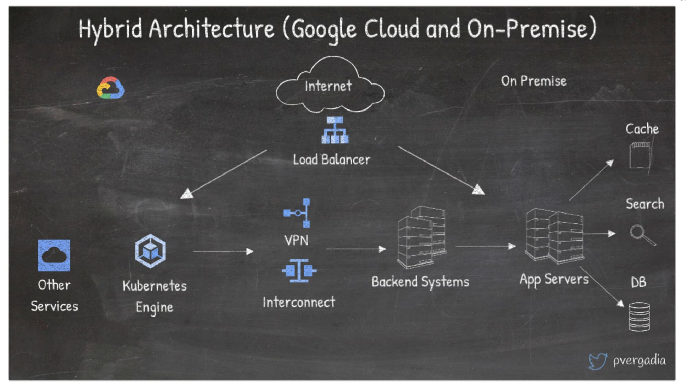

# Popular architectures

## 1. Set up a hybrid architecture on Google Cloud and on-premises

// 

 

https://cloud.google.com/blog/products/application-development/13-popular-application-architectures-for-google-cloud