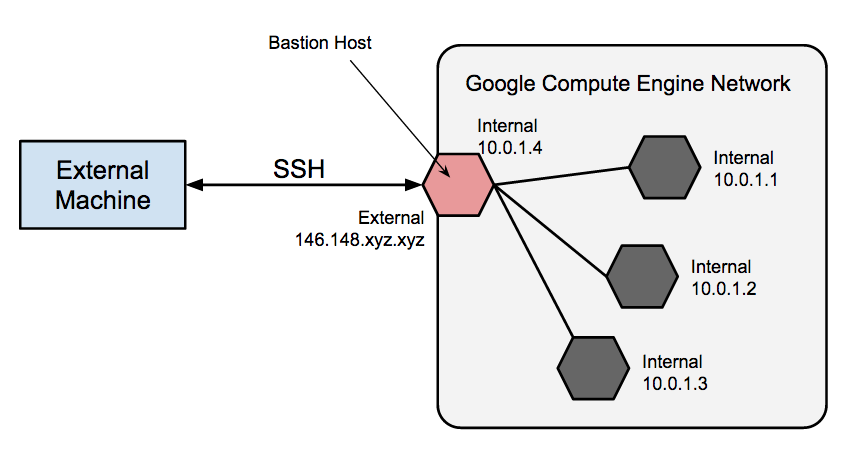

# Security

#### Binary Authorization
Binary Authorization is a deploy-time security control that ensures only trusted container images are deployed on Google Kubernetes Engine (GKE) or Cloud Run. 

With Binary Authorization, you can require images to be signed by trusted authorities during the development process and then enforce signature validation when deploying. By enforcing validation, you can gain tighter control over your container environment by ensuring only verified images are integrated into the build-and-release process.

#### NAT vs Bastion
 NAT instances allows outbound traffic from instances in VPC where as Bastion instance allows inbound SSH to the instances in VPC.

Bastion hosts provide an external facing point of entry into a network containing private network instances. This host can provide a single point of fortification or audit and can be started and stopped to enable or disable inbound SSH. By using a bastion host, you can connect to an VM that does not have an external IP address. This approach allows you to connect to a development environment or manage the database instance for your external application without configuring additional firewall rules.

https://cloud.google.com/solutions/connecting-securely